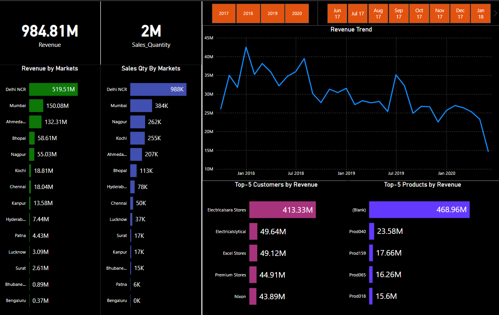

# Computer Hardware Business Sales Analysis

## Project Overview

This project analyzes sales data for a computer hardware business facing a rapidly changing market. With real-time insights, the dashboard enables the Sales Director to make data-driven decisions and respond to market trends effectively. Through data extraction, transformation, and visualization, this project demonstrates the application of SQL, Power Query, and Power BI to create an impactful data analysis solution.

The key skills involved include:
- **Data Munging and ETL**: Transforming raw data for consistency and usability.
- **SQL for Data Integration**: Extracting and connecting data from MySQL Server.
- **Power Query for Data Transformation**: Cleaning, filtering, and standardizing data.
- **Power BI for Visualization**: Building an interactive dashboard that provides insights into revenue, sales quantity, market performance, and customer behavior.

## Skills Demonstrated

### 1. Data Extraction and Transformation (ETL) Using Power Query

- **Data Cleaning**: Resolved inconsistencies in the dataset, such as occurrences of "INR" currency values repeated twice in some transaction records. Ensured a uniform format across all transaction currency fields.
- **Currency Conversion**: Converted data from USD to INR for seamless analysis, ensuring that all financial metrics were consistent and comparable.
- **Data Filtering**: Removed markets that were not within India, enabling a more focused analysis on relevant regions.

### 2. Database Integration Using SQL

- **MySQL Integration**: Established a connection between MySQL server and Power BI, allowing real-time data flow and analysis.
- **Data Querying**: Used SQL queries to extract relevant fields from the MySQL database, minimizing redundant data and improving load performance.
- **Data Preparation**: Prepared and organized data within MySQL for efficient ETL processing in Power Query.

### 3. Data Visualization Using Power BI

- **Interactive Dashboard**: Designed a Power BI dashboard to provide quick insights into sales metrics, including:
  - **Revenue**: The business achieved a total revenue of **984.81M INR**.
  - **Sales Quantity**: The total units sold reached **2M**.
  - **Top Markets**: Delhi NCR stood out as the highest-grossing market with **519.51M INR** in revenue and **988K** units sold.
  - **Revenue Trend**: Visualized revenue trends over time, showing fluctuations and identifying periods of peak performance.
  - **Top Customers and Products**: Highlighted key customers and products contributing to revenue, with Electricalsara Stores generating **413.33M INR** and the leading product category achieving **468.96M INR**.

### 4. Insights Derived from Analysis

The following insights were drawn from the analysis:

- **Market Performance**: Delhi NCR, Mumbai, and Ahmedabad emerged as top markets in both revenue and sales quantity, suggesting high demand in these regions.
- **Sales Distribution**: Sales quantity varied significantly across markets, with Delhi NCR far outperforming others at **988K units** compared to the next highest, Mumbai, at **384K units**.
- **Revenue Trend**: The line chart visualizing revenue over time illustrates a peak in early 2018, followed by fluctuations, and a declining trend into 2020. This insight could prompt further analysis into factors affecting sales during this period.
- **Top Customers and Products**: Electricalsara Stores was the highest revenue contributor, while an unnamed product brought in the largest product revenue at **468.96M INR**. These insights can guide sales and marketing teams to prioritize high-value customers and products.

## Conclusion

This project showcases expertise in data analysis, SQL, Power Query, and Power BI. By transforming complex data into actionable insights, the dashboard enables better decision-making for the Sales Director and aligns the company’s strategy with real-time data. The ability to effectively cleanse, structure, and visualize data proves invaluable for businesses operating in dynamic markets.

--- 

This README file can help your project stand out by demonstrating technical and analytical skills. Let me know if you need further customization!
